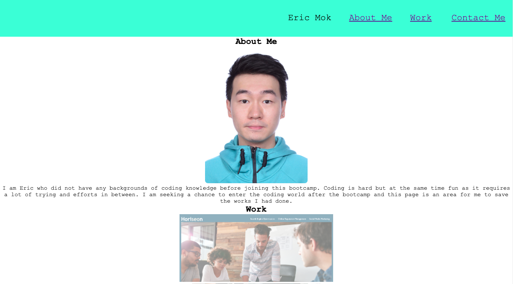

# Week 2 Challenge
### Motivation: Build a porfolio website for saving work samples and applying opening positions
### Reasons for building the project: Building a good-looking porfolio for future careers.
### Steps Involved:
1. Building the html skeleton
2. Divided the HTML into Header, Main and Footer parts
3. Insert alt attributes for the images
4. Build CSS to design the appearance of the website
5. Create hyperlink to designated sites
# Knowledge learned from the process
1. Adjust the code step by step and keep revising the code
2. Keep trying the code in sequences without jumping from parts to part
3. Try out different codes to learn more

The URL of the Github repository:  https://ericthmok.github.io/fantastic-engine-new-profo/

## License
MIT License

Copyright (c) [2022 [Tsz Him Eric Mok]

Permission is hereby granted, free of charge, to any person obtaining a copy
of this software and associated documentation files (the "Software"), to deal
in the Software without restriction, including without limitation the rights
to use, copy, modify, merge, publish, distribute, sublicense, and/or sell
copies of the Software, and to permit persons to whom the Software is
furnished to do so, subject to the following conditions:

The above copyright notice and this permission notice shall be included in all
copies or substantial portions of the Software.

THE SOFTWARE IS PROVIDED "AS IS", WITHOUT WARRANTY OF ANY KIND, EXPRESS OR
IMPLIED, INCLUDING BUT NOT LIMITED TO THE WARRANTIES OF MERCHANTABILITY,
FITNESS FOR A PARTICULAR PURPOSE AND NONINFRINGEMENT. IN NO EVENT SHALL THE
AUTHORS OR COPYRIGHT HOLDERS BE LIABLE FOR ANY CLAIM, DAMAGES OR OTHER
LIABILITY, WHETHER IN AN ACTION OF CONTRACT, TORT OR OTHERWISE, ARISING FROM,
OUT OF OR IN CONNECTION WITH THE SOFTWARE OR THE USE OR OTHER DEALINGS IN THE
SOFTWARE.
